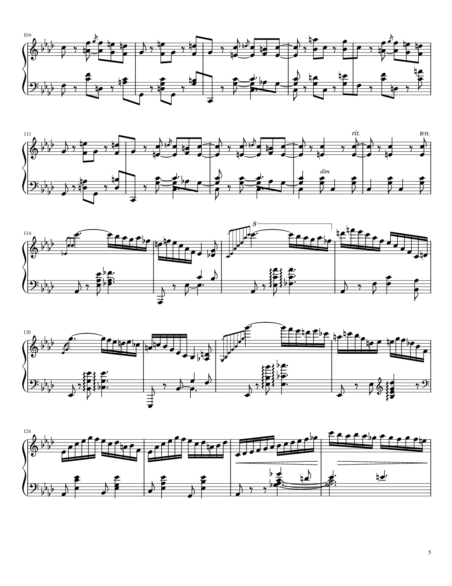
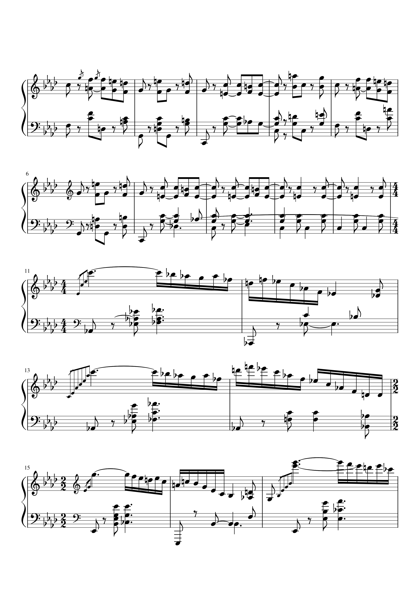
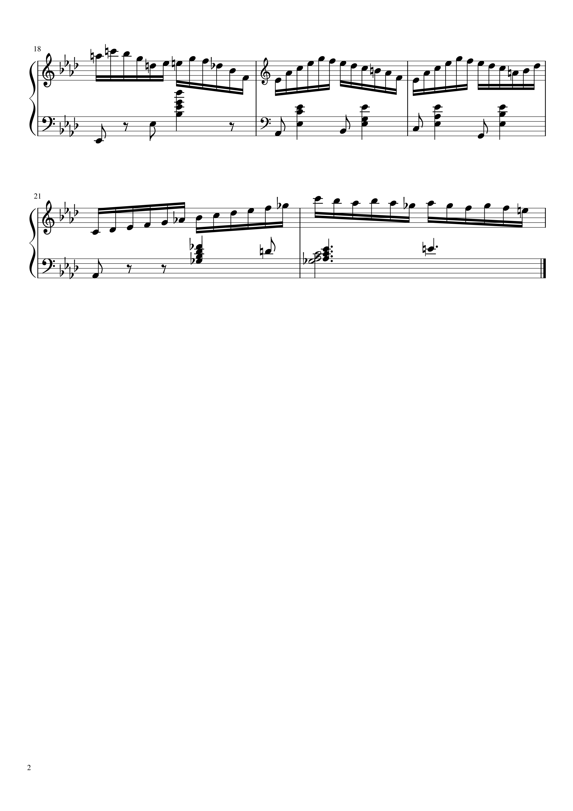
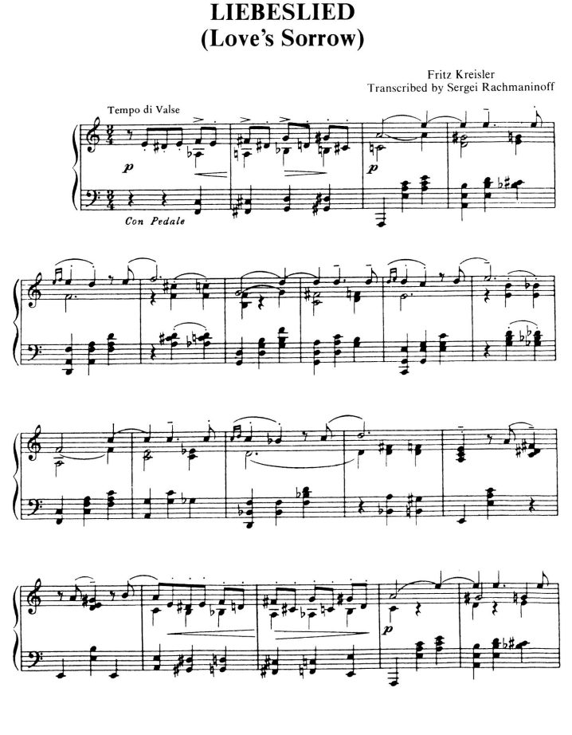
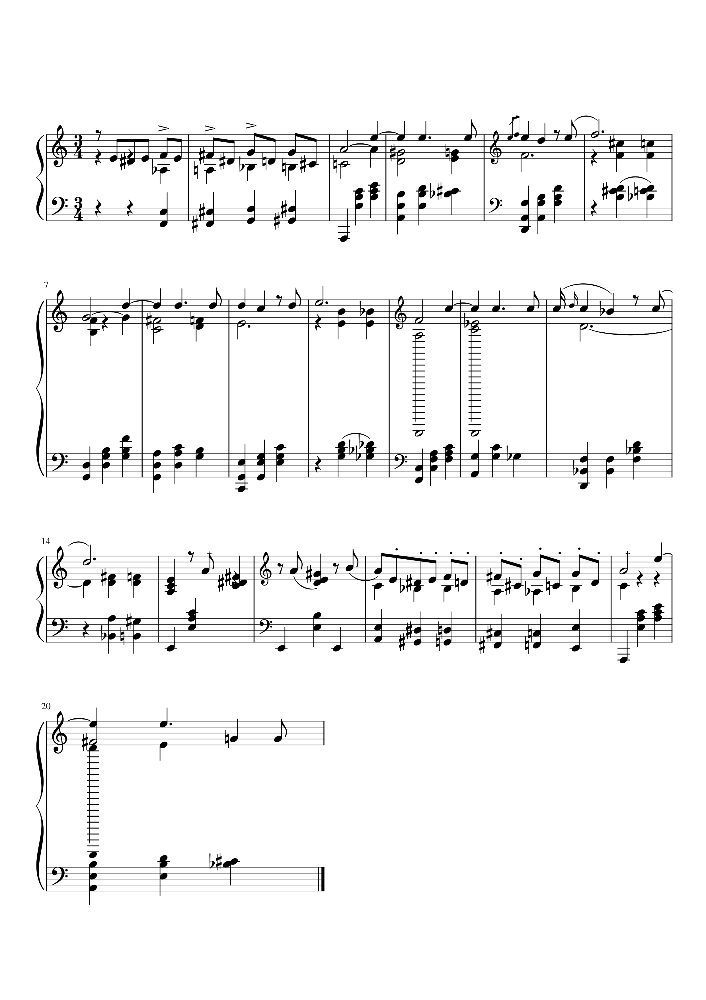
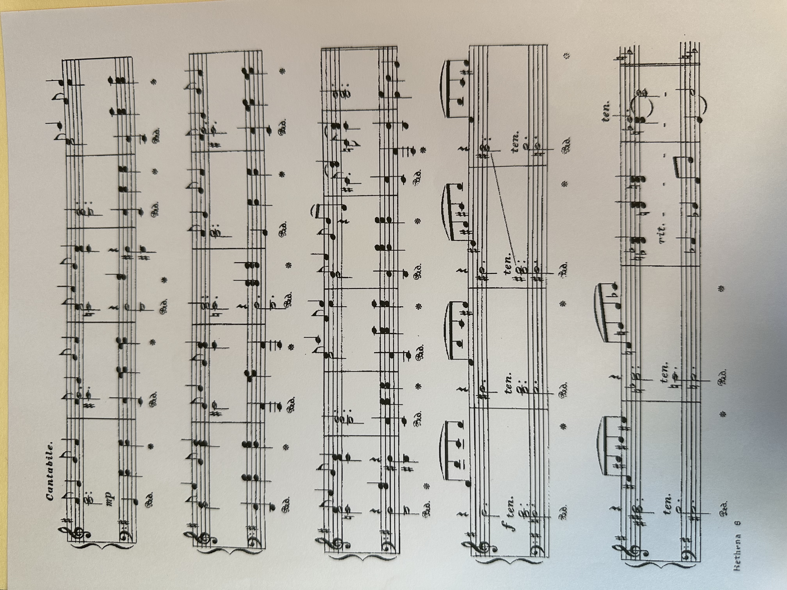
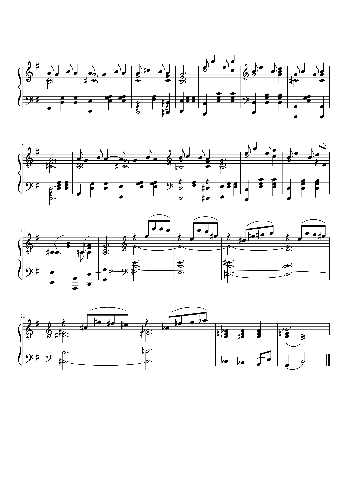

# Acai OMR 

It's not uncommon for a musician to be manually transcribing sheet music to a digital format using notation software. For instance, if you have a printed sheet and you want to add another part for a new instrument, you'd have to open up notation software, transcribe the sheet yourself (which is ***slow*** and cumbersome), add your changes, and reprint the sheet.

This project contains an end-to-end image to text model that transcribes images of pianoform sheet music into musicxml files, allowing users to avoid the boring and tedious process of manual transcription. It also comes with a UI.

***Use it right now here: [acaiomr.com](https://acaiomr.com)***.

### Table of Contents

- [Acai OMR](#acai-omr)
    - [Table of Contents](#table-of-contents)
    - [Model Features](#model-features)
    - [Some Example Outputs](#some-example-outputs)
    - [Model Evaluation](#model-evaluation)
    - [Quickstart](#quickstart)
      - [Installation](#installation)
      - [Options for Local Use](#options-for-local-use)
    - [More Details](#more-details)
    - [License](#license)

---

### Model Features

- Works on real-world domains -- the model can transcribe both high quality scans and more difficult photos taken with a phone camera 
- Lightweight and fast enough to run on device, even those with very weak CPUs
- Able to support inputs/ragged batches spanning many resolutions, crucial for dealing with unideal Optical Music Recognition (OMR) datasets

### Some Example Outputs

The best results can be seen on screenshots of digitally typeset scores (eg from Musescore).

**Input:**  


**Reconstructed score:**  



While there will be more errors on digital scans and photos of printed sheets, overall the model still saves a huge amount of time: manually correcting the errors is orders of magnitude faster than transcribing everything from scratch.

**Input:**  


**Reconstructed score:**  


**Input (taken with a phone camera):**  


**Reconstructed score:**  


Note that the model was trained exclusively with pianoform music, meaning two staves per musical system (a system is one unbroken row of staves that are played simultaneously). Additionally, it was trained on images containing only one system, so whole sheets will have to be split into individual systems. 

### Model Evaluation

| Model | Task | Loss
|---|---|---|
| Masked Autoencoder (MAE) | Image reconstruction (normalized pixel MSE) | 0.159 |
| Sequence-to-sequence model (ViTOMR) | Text generation (cross entropy loss) | 0.056 |

### Quickstart

#### Installation

Install Python and poetry. Then run:

```
git clone --recurse-submodules https://github.com/jsnchon/acai-omr
cd acai-omr 
poetry install
sudo apt update
sudo apt install musescore3 && sudo apt install imagemagick
```

#### Options for Local Use

There are a few ways to use this project locally.

First, you can download the model weights from the Releases page. Then, edit `acai_omr/config.py` to point to the weights path. This file also contains other important general constants. Constants specific to certain parts of the project will be defined in individual files.

If you want to run/modify bare-bones inference, refer to `acai_omr/inference/vitomr_inference.py`.

If you want to configure/modify/run model architecture or training scripts, refer to `acai_omr/models` and `acai_omr/train`.

If you want to run the full application yourself, run `poetry run flask --app acai_omr run`.

### More Details

[Model architecture](docs/model_architecture.md)

[Training](docs/training.md)

[Design decisions](docs/design_decisions.md)

[Guiding papers](docs/guiding_papers.md)

### License

This repository's source code is available under the MIT license.
