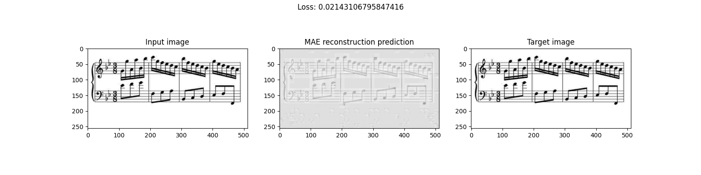

## Training

### Pretraining

Due to the extreme domain shift from common ViT pretraining datasets like ImageNet, I pretrained my own encoder to ensure it had a useful latent representation for images of music. The encoder was pretrained as part of a Masked Autoencoder on an image reconstruction task. 

In anticipation of using the model on photos from a camera, light camera-like image augmentation was applied. When augmentation was applied, the reconstruction target was the unaugmented version of the image to hopefully learn representations that are robust to camera artifacts.

The pretraining dataset comprises score images from the DoReMi, PrIMuS, GrandStaff, and OLiMPiC datasets.

#### Pretraining hyperparameters

| Hyperparameter | Value | 
|----------|----------|
| Batch size  | 64 |
| Learning rate | 1.5e-4 |
| AdamW Betas | (0.9, 0.95) |
| AdamW weight decay | 0.05 |
| Epochs | 500 |
| Warmup epochs | 50 |
| Image augmentation probability | 0.2 |
| Decoder depth | 8 |
| Decoder hidden dimension | 512 |

#### Pretraining curriculum

Learning rate warmup was linear and cosine annealing was applied throughout the rest of training.

Here's an example of the trained Masked Autoencoder's outputs:

### Decoder training

I experimented with several types of training for the full encoder-decoder model, but the current version was trained using scheduled sampling.

The encoder was fully fine-tuned given the gap between the image reconstruction and music transcription tasks. To minimize the risk of catastrophic forgetting, layer-wise linear decay was applied.

The OLiMPiC dataset (including its version of the Grandstaff dataset) was used for a total of 56,612 images.

In anticipation of using the model on photos from a camera, generous camera-like image augmentation was applied.

#### Decoder training hyperparameters

| Hyperparameter | Value | 
|----------|----------|
| Batch size  | 64 |
| Decoder learning rate | 1e-4 |
| Fine-tune learning rate | 1e-05 |
| Layer-wise decay factor | 0.9 |
| AdamW Betas | (0.9, 0.95) |
| AdamW weight decay | 0.01 |
| Epochs | 40 |
| Warmup epochs | 2 |
| Image augmentation probability | 0.5 |
| Encoder/transition head dropout | 0.05 |
| Decoder dropout | 0.1 |
| Decoder depth | 12 |
| Decoder hidden dimension | 1024 |

#### Decoder Curriculum

Learning rate warmup was linear and cosine annealing was applied throughout the rest of training.

Teacher forcing probability at each time step started at 1.0 and linearly decayed to 0.0. Gumbel-Softmax tau started at 5.0 and exponentially decayed to 0.1 over the same time period. Straight-through Gumbel-Softmax sampling was used for the last half of training.

### A Note on GRPO

There is a complete GRPO training loop with a complete reward function containing many weightable components, but supervised training already got the model to a point where GRPO couldn't add much improvement. 

Additionally, GRPO training is slow because tree edit distance has to be calculated on outputted sequences as part of reward calculation. This is already parallelized through multiprocessing but remains a significant bottleneck.

Feel free to play around with the code though.
